# Graphic Design Portfolio

A curated collection of graphic design works created using **CorelDRAW**, covering event visuals, promotional materials, social media content, apparel design, information design, and visual assets.

> This repository is designed as a **visual portfolio showcase**. The goal is to let recruiters and collaborators review the work directly without needing to open the original CorelDRAW files.

---

## Selected Works

### Event & Promotional Design

A selection of visual materials created for events, organizational activities, and promotional communication.

#### Diklatsar Banner

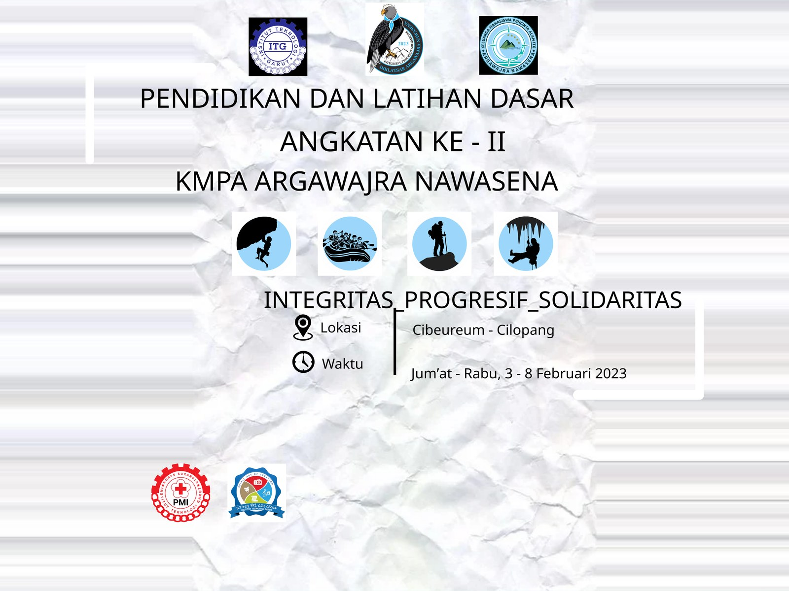

#### Penempuhan Banner

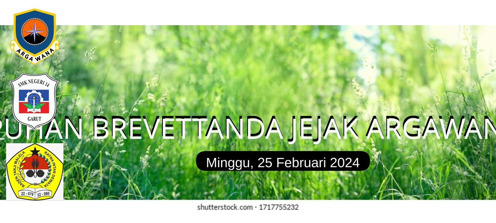

#### Countdown Diklatsar

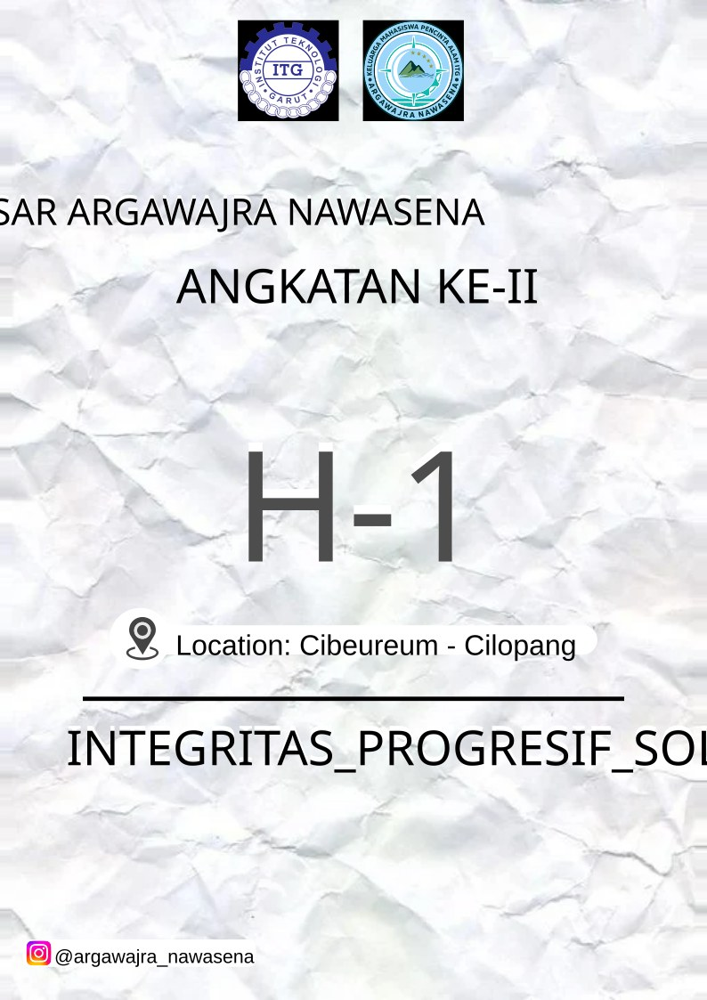

#### Hari Jadi Garut

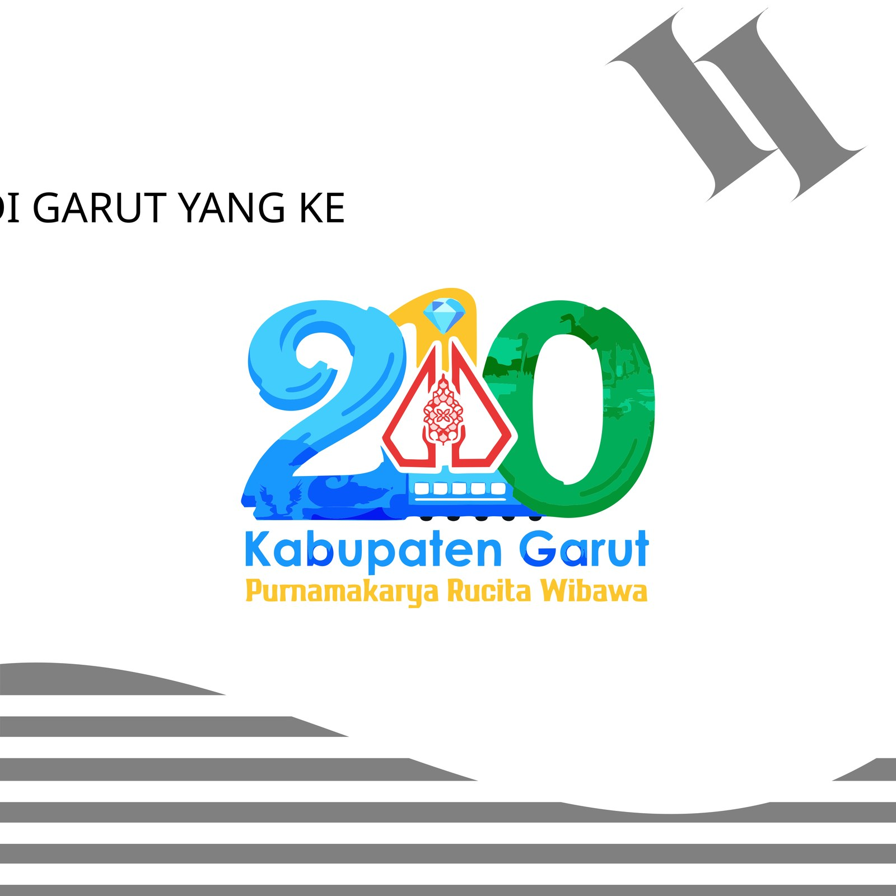

---

## Social Media Design

Visual content designed for digital and social media communication.

#### Instagram Feed

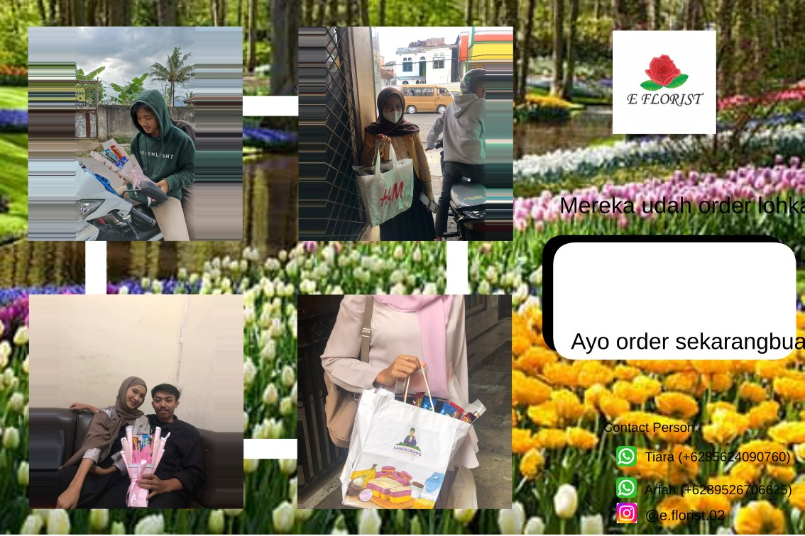

#### Twibbon Diksar

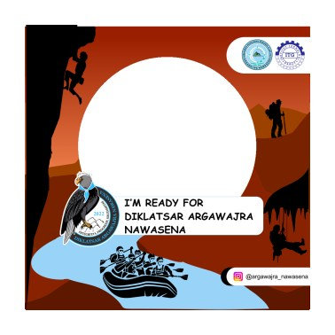

---

## Apparel & Merchandise Design

Design exploration for apparel and merchandise applications.

#### Werewolf Jersey Design

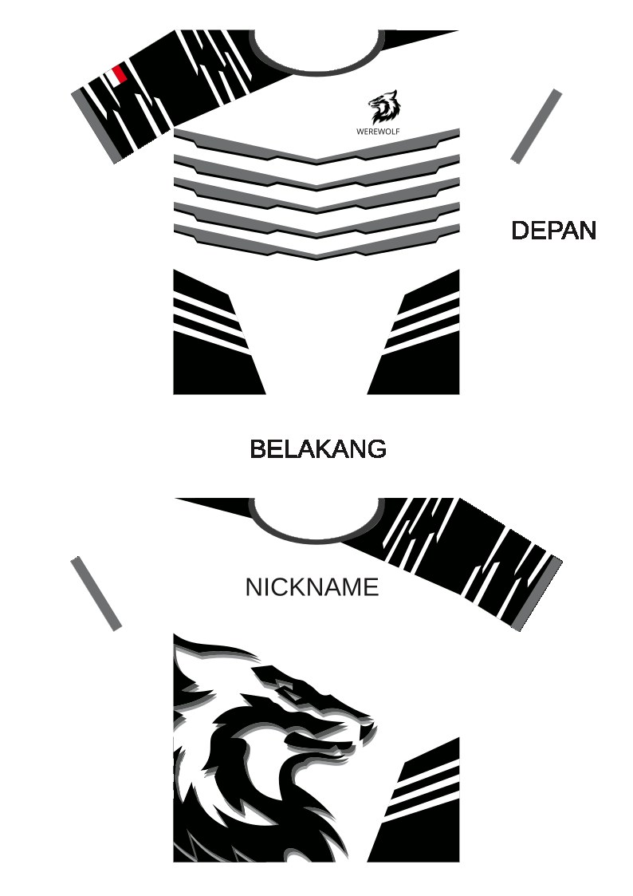

#### Jersey Mockup

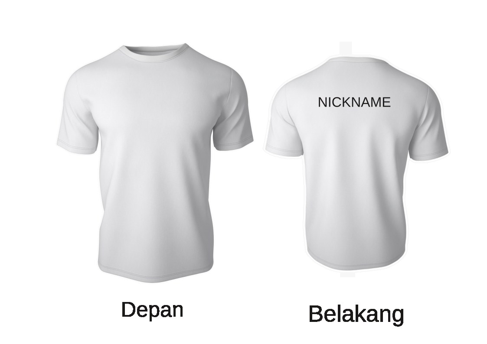

---

## Information & Layout Design

Designs focused on presenting information in a structured and readable visual format.

#### Journey Map

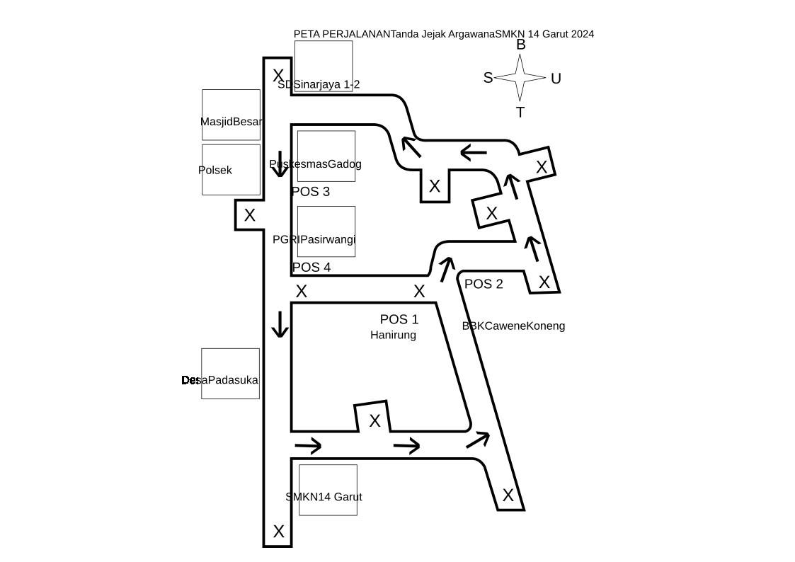

#### Certificate Design

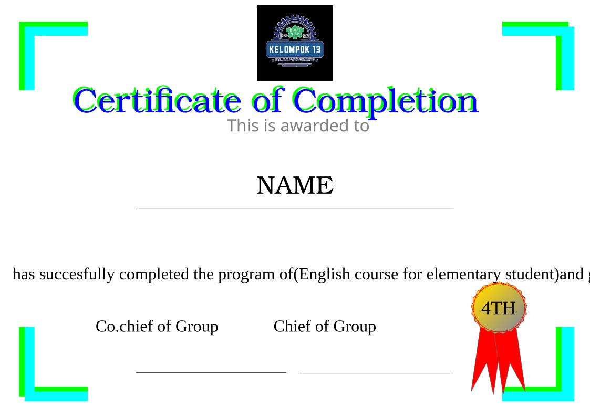

#### Business Model Canvas — SafeGas

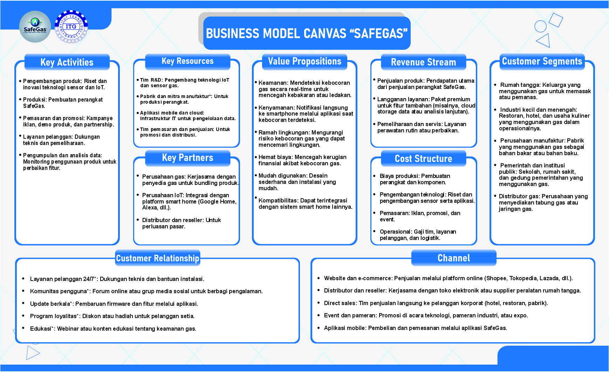

---

## Supporting Visual Assets

Additional design work including sticker artwork and interface-related visual assets.

#### AWN Sticker

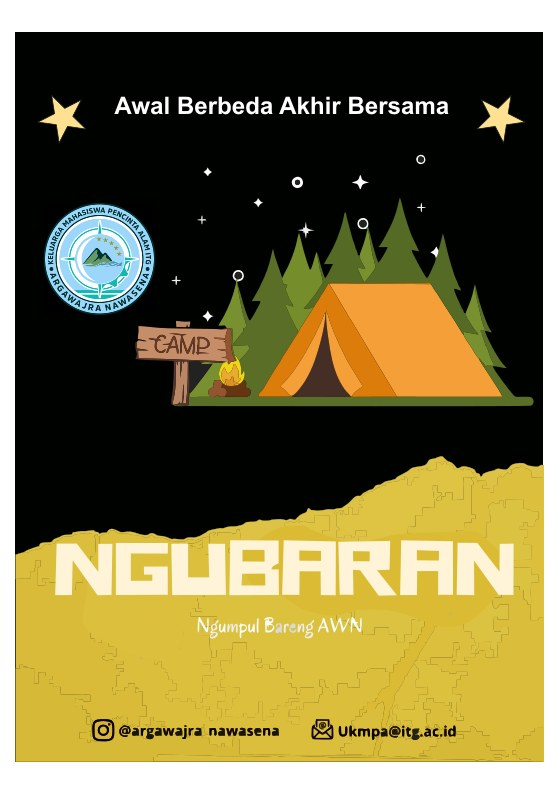

#### Road Monitoring Phone Visual

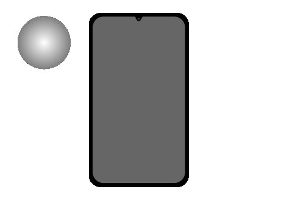

---

## Design Skills

- Graphic Design
- Poster & Banner Design
- Social Media Design
- Layout Design
- Typography
- Promotional Visuals
- Apparel & Merchandise Design
- Information Design
- Certificate Design
- Visual Asset Design

## Tools

- **CorelDRAW**

## Portfolio Structure

```text
Graphic-Designer/
├── README.md
└── docs/
    └── images/
        ├── banner-diklatsar.jpg
        ├── banner-penempuhan.jpg
        ├── countdown-diklatsar.jpg
        ├── hari-jadi-garut.jpg
        ├── feed-instagram.jpg
        ├── twibbon-diksar.jpg
        ├── jersey-werewolf-design.jpg
        ├── jersey-werewolf-mockup.jpg
        ├── peta-perjalanan.jpg
        ├── certificate-design.jpg
        ├── bmc-safegas.jpg
        ├── sticker-awn.jpg
        └── phone-road-monitoring.jpg
```

## About the Portfolio

This repository presents selected graphic design work as part of my broader creative portfolio. My work combines visual communication, layout, typography, promotional design, and digital content creation.

For a broader view of my work across **UI/UX, Game Development, 3D, Multimedia, and Graphic Design**, please visit my GitHub profile.

---

**Graphic Design Portfolio — Sadam Alkayyis**
